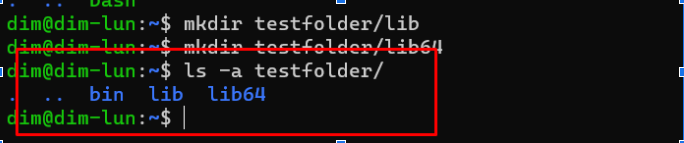
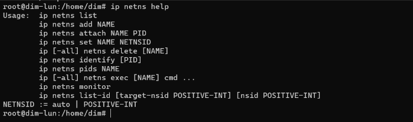

Артемьев Дмитрий Владимирович 

## Homework 1

1. sudo apt-get upgrade -  downloads and installs the updates for each outdated package and dependency on your system

2. Create folder  "testfolder":
mkdir testfolder

3. Copy the shell executable /bin/bash in folder "testfolder/bin":
cp /bin/bash testfolder/bin

4. Create needed directory "testfolder/lib" и "testfolder/lib64":

    mkdir testfolder/lib

    mkdir testfolder/lib64

5. Copy needed lib in folder "testfolder/lib" and "testfolder/lib64".

    cp /lib/x86_64-linux-gnu/libtinfo.so.6 testfolder/lib

    cp /lib/x86_64-linux-gnu/libc.so.6 testfolder/lib

    cp /lib64/ld-linux-x86-64.so.2 testfolder/lib64/

6. Start comand "chroot" for change root folder:
   
    chroot testfolder /bin/bash

1. ip netns help — view help command netns
   

1. ip a view IP adress

9. Ps aux - start a tool to monitor processes running on your Linux system

