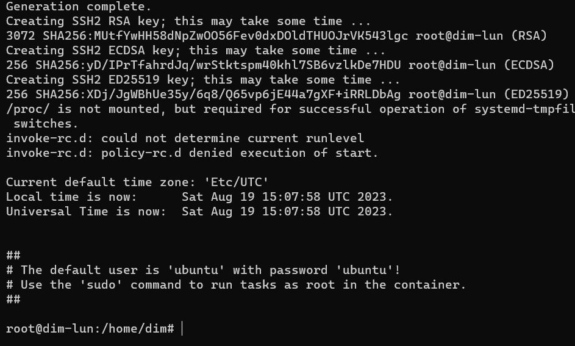
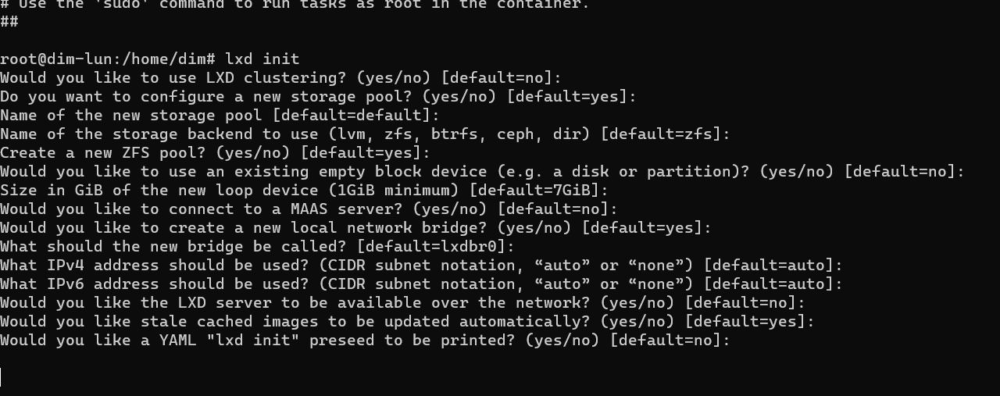
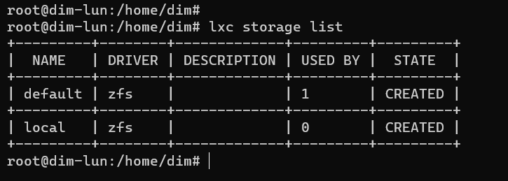
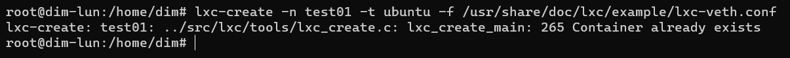
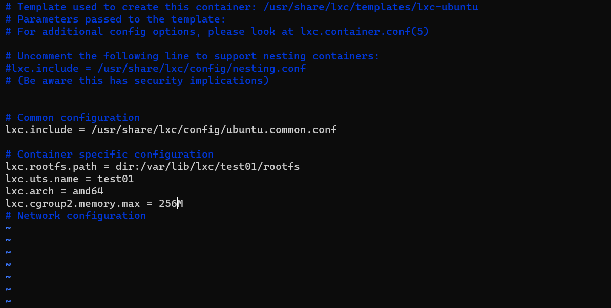
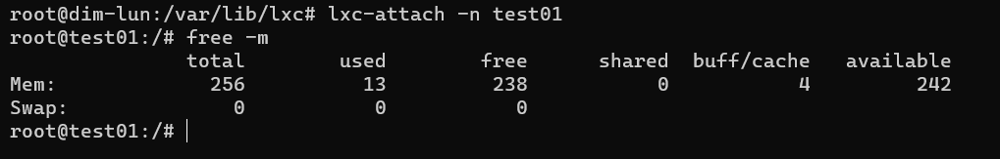

Артемьев Дмитрий Владимирович

## HOMEWORK 2

1. Install necessary software lxd and lxc
     
apt-get install lxc debootstrap bridge-utils lxc-templates

apt-get install lxd-installer

2. Start initialization wizard

lxd init 

3. Check
   
lxc storage list

4. Created container
   
lxc-create -n test01 -t ubuntu -f /usr/share/doc/lxc/example/lxc-veth.conf

5. Open file config /var/lib/lxc/test01/config

nano /var/lib/lxc/test01/config

and past string with limited memory

6. Start container

lxc-start -n test01 

lxc-attach -n test01 

7. Check limited memory

