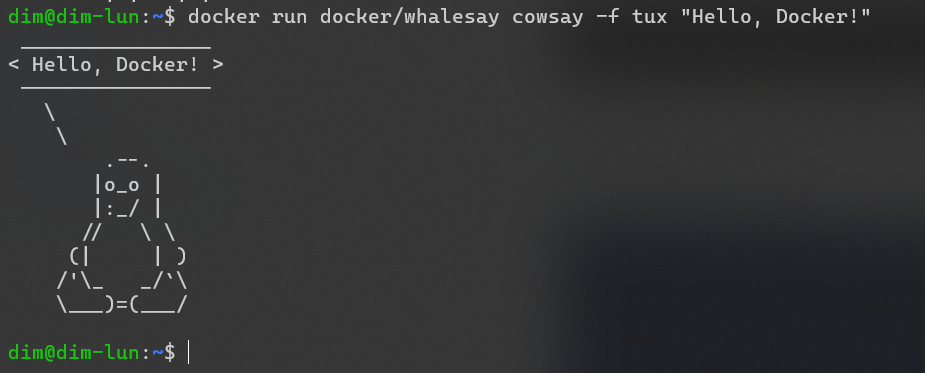
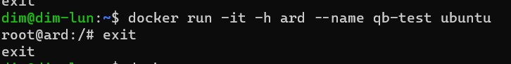

Artemiev Dima

## HOMEWORK #3

1. Update and install apt package linux

command: sudo apt update && sudo apt upgrade

2. Install package 
   
command: sudo apt install apt-transport-https ca-certificates curl software-properties-common

3. Add official GPG-key Docker:

command: curl -fsSL https://download.docker.com/linux/ubuntu/gpg | sudo gpg --dearmor -o /usr/share/keyrings/docker-archive-keyring.gpg

4. Add repository Docker to the list package source

command: echo "deb [signed-by=/usr/share/keyrings/docker-archive-keyring.gpg] https://download.docker.com/linux/ubuntu $(lsb_release -cs) stable" | sudo tee /etc/apt/sources.list.d/docker.list > /dev/null

5. Update and install apt package linux

command: sudo apt update && sudo apt upgrade

6. Install Docker

command: sudo apt install docker-ce

7. Add User in docker group, to avoid using sudo to run docker commands
   
command: sudo usermod -aG docker $USER

8. Reboot your system or run following command to apply the chenges in the current session

command: newgrp docker

9. Check version Docker

command: docker --version

10. Test container using image "cowsay"

command: docker run docker/whalesay cowsay Hello, Docker!

command: docker run docker/whalesay cowsay -f elephant "Hello, Docker!"

command: docker run docker/whalesay cowsay -f tux "Hello, Docker!"

command: docker run docker/whalesay cowsay -f dragon "Hello, Docker!"

command: docker run docker/whalesay cowsay -f kitty "Hello, Docker!"

11. Create and run container

Смотрим, какие образы у нас установлены.

command: docker images

comand: docker create ubuntu 

command: docker ps -a

command: docker rm 02ce2c19b859

command: 

Run container

command: docker run -it -h ard --name gb-test ubuntu:22.10

command: ls -l

Создадим новую директорию в корне.

command: mkdir example

Создадим файл "passwords.txt", добавим в него какие-либо данные и сделаем вывод файла. В контейнере не установлен текстовый редактор, но мы справимся без него.

command:  

touch passwords.txt
echo "123test" >> /exempel/password.txt

Поработаем с внешним хранилищем

