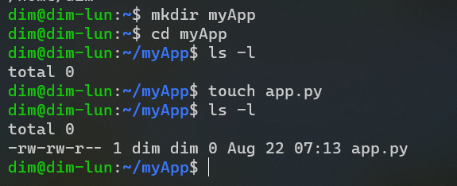
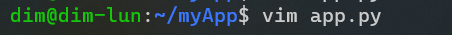
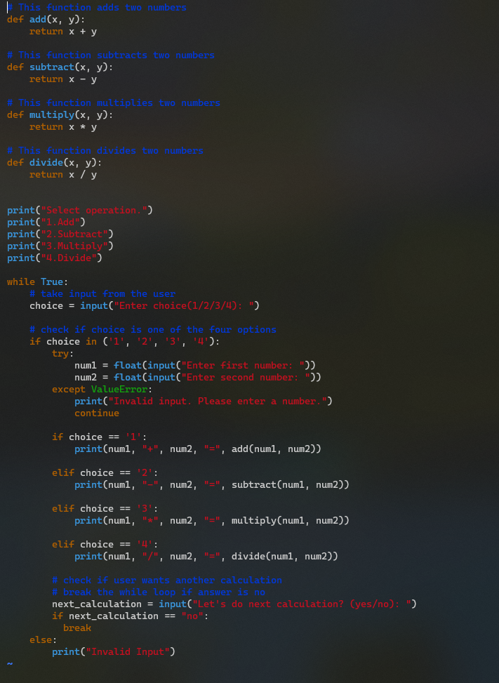
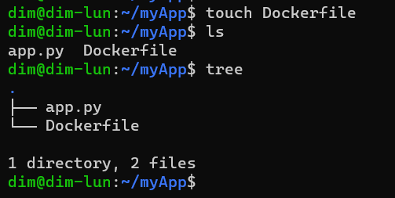
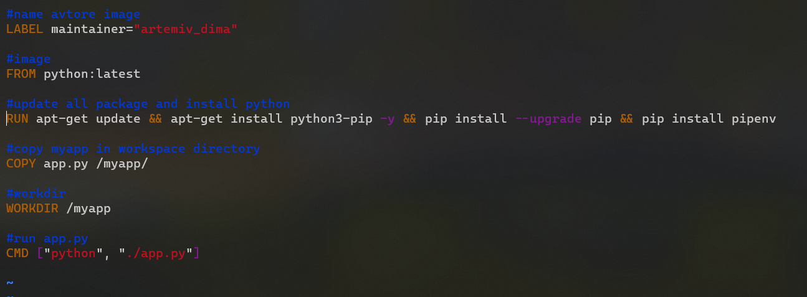

Artemiev Dima

## HOMEWORK #4

1. Update and install apt package linux

command: sudo apt update && sudo apt upgrade

2. Create folder "myApp" and create file app.py
command: mkdir myApp
comnamd: touch app.py

3. Open the file with vim and write the program
   
command: vim app.py

4. Create Dockerfile

command: touch Dockerfile

5. Edit Dockerfile

command: vim Dockerfile

6. Run dockerfile 
   
command: docker build -t calc .

