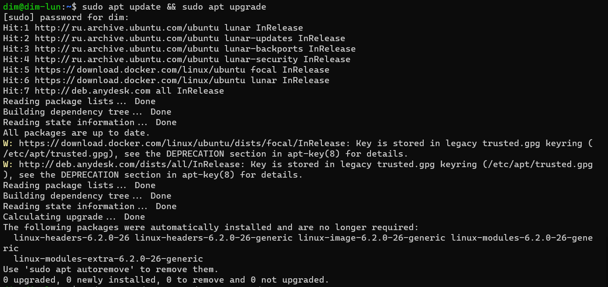
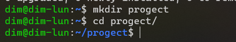
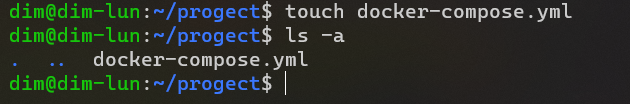
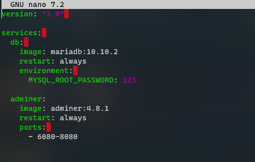
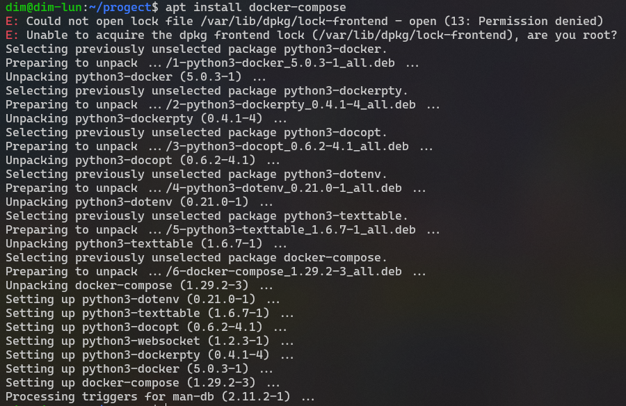
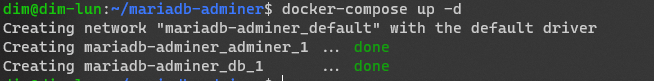
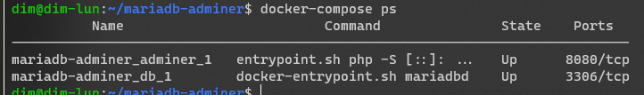
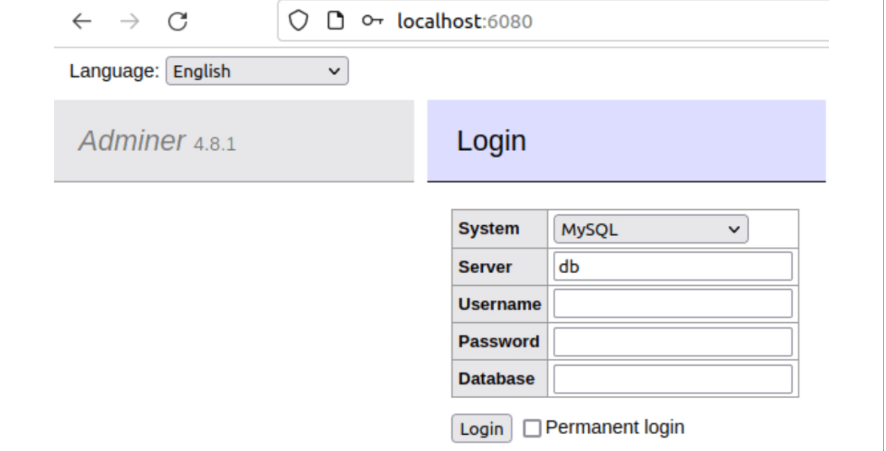
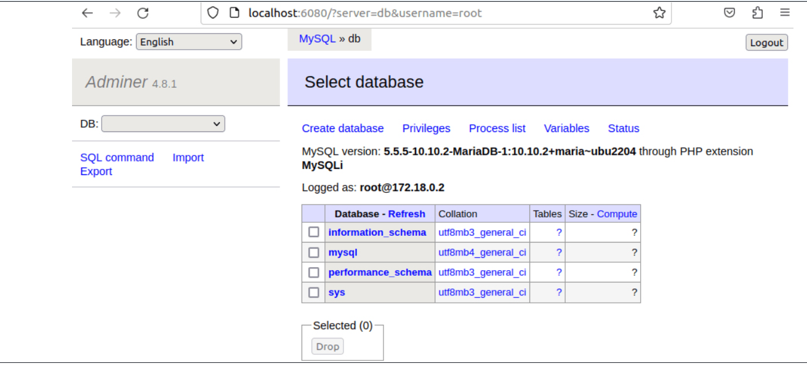

Artemiev Dima

## HOMEWORK #5

1.  Update all packages

command:  sudo apt update && sudo apt upgrade

2. Create folder for progect

command: mkdir progect

3. Create in folder yml-file with name docker-compose.yml

command: touch docker-compose.yml

4. Install docker-compose

command: apt install docker-compose

5. Create and run project

command: docker-compose up -d

6. Check a create two containers

command: docker-compose ps

7. Open page http://localhost:8081

8. Вбиваем в форму имя пользоваля root и пароль, который мы указывали в докер-компоуз файле в переменных среды - test123, и входим в Adminer. Видим, что используется база данных MariaDB.

